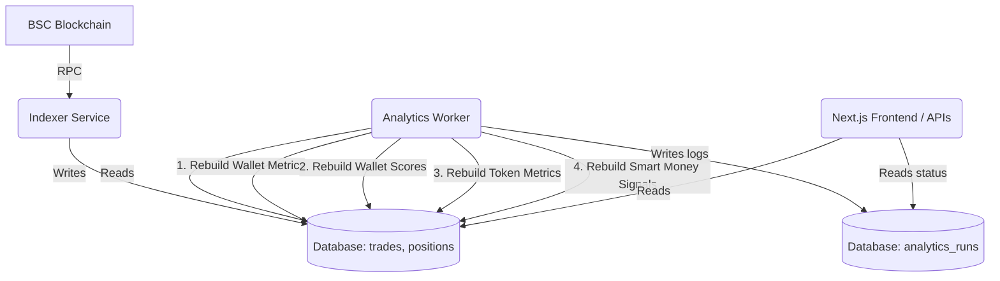

# Architecture Review: Phase 8A.5 Live Analytics Automation

## Overview
Phase 8A.5 transitions Toro's intelligence generation from manual rebuild scripts to a continuously running "live" system. As blockchain trades are ingested by the indexer, the intelligence layer now automatically recalculates wallet scores, token metrics, and smart money signals so the system and frontend always reflect near-real-time reality.

## 1. Incremental vs. Batch Processing Feasibility
A key technical decision was determining whether to adopt **incremental updates** (e.g., updating a single wallet and token's score upon a new trade) or continue using **batch recalculations**.

**Finding:** Incremental updates are mathematically incompatible with the current ranking model.
The `wallet_scores` and `smart_money_signals` schemas heavily rely on percentile ranking (`PERCENT_RANK()`) to determine a wallet or token's relative standing within the entire ecosystem. Because a single trade by one wallet can slightly shift the percentile rank of thousands of other wallets, true incremental updates would either:
1. Cause severe global score drift over time.
2. Require complex, bug-prone state tracking logic to approximate percentiles.

**Solution: The Reconciliation Scheduler**
Because the existing full-rebuild CTE queries are highly optimized by PostgreSQL (processing 23,000+ wallets in ~3-5 seconds), we adopted a **Reconciliation Scheduler** pattern. The analytics worker runs a fast, full-table recalculation loop every 60 seconds. This delivers a near-real-time experience with zero risk of score drift, bypassing the complexity of partial updates entirely.

## 2. Deployment Architecture
To ensure high availability and separation of concerns, the analytics pipeline is segregated into its own deployable unit (`@toro/analytics-worker`) rather than being embedded in the indexer.

### Benefits:
- **Resilience:** If the analytics worker crashes or stalls, the indexer continues fetching trades.
- **Resource Allocation:** The indexer (I/O bound) and analytics worker (CPU/DB bound) can be scaled independently on Render.
- **Clean Logs:** Analytics SQL logs do not pollute the indexer's block-fetching output.

## 3. Decision Engine Scope
The worker explicitly stops at `smart_money_signals` and **does not** generate `trade_recommendations`. 
Recommendations depend on user-specific constraints (Risk Profile, Open Positions, Portfolio State, Available Capital). Generating them globally in a background worker would not map accurately to individual users or autonomous agents. Recommendation generation remains a user/agent-triggered flow (`DecisionEngine.run(user)`).

## 4. System Monitoring
The frontend exposes three new API routes to monitor the pipeline's health:
- `GET /api/system/health`: Basic API uptime.
- `GET /api/system/indexer`: Tracks the latest indexed block and trade to measure indexer lag.
- `GET /api/system/analytics`: Tracks the latest `analytics_runs` execution to measure intelligence freshness.

## 5. Success Criteria Met
Within 60 seconds of a new trade being indexed:
1. The trade enters the database.
2. The `analytics-worker` loop triggers.
3. Wallet scores and token metrics are rebuilt.
4. Smart money signals reflect the latest entries/exits.
5. The Next.js frontend fetches the updated data via its existing hooks.
6. The system is live without developer intervention.
