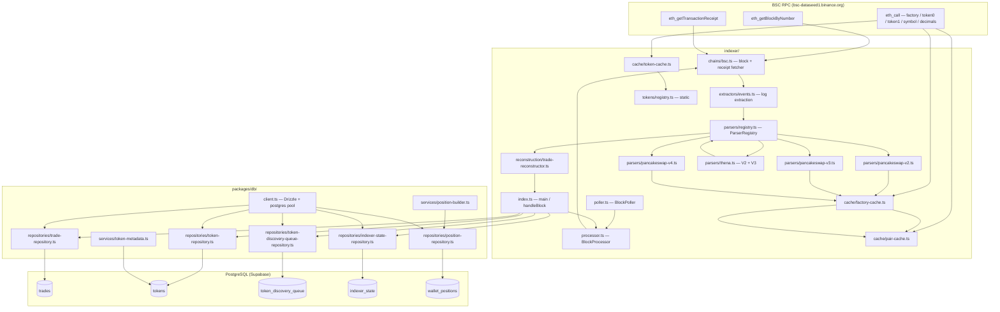

# Aether — Current System Audit

**Date:** 2026-06-18  
**Branch:** feat/db  
**Scope:** `indexer/`, `packages/db/` — active backend only  
**Excluded:** `watcher/`, `frontend/`, `landing/` (deprecated)

---

## 1. Executive Summary

**What Aether currently does**

Aether is a high-performance on-chain trade indexer for BSC (Binance Smart Chain). It watches every block produced on BSC, extracts swap events from PancakeSwap V2/V3/V4 and Thena, normalizes them into a canonical trade format, and persists them to a PostgreSQL database. On top of the raw trade history it maintains a derived `wallet_positions` table that accumulates each wallet's aggregated bought, sold, and net token amounts.

**What problem it solves today**

Raw BSC blocks are noisy and protocol-specific. Reconstructing "which wallet swapped X for Y in what amount" requires fetching receipts, decoding ABI-encoded events, resolving token-pair contracts, and handling four incompatible swap event signatures. Aether automates all of that and exposes clean, queryable rows. Any downstream system — analytics, scoring, alerting — can query `trades` and `wallet_positions` directly without touching the RPC.

**Major completed systems**

| System | Status |
|---|---|
| Block ingestion (batch + live) | Production-ready |
| Receipt fetching with retry + stats | Production-ready |
| DEX parsers: PancakeSwap V2/V3/V4, Thena V2/V3 | Production-ready |
| Trade normalization & reconstruction | Production-ready |
| Database schema + migrations | Production-ready |
| Bulk DB persistence (trades, tokens, queue) | Production-ready |
| DB checkpoint (indexer_state) | Production-ready |
| Position engine (rebuildAll, rebuildWallet, applyTrades) | Production-ready |
| Token metadata caching (on-chain + static registry) | Production-ready |
| Process lifecycle (SIGTERM/SIGINT, exit-code 0) | Production-ready |
| Validation suite (audit, validate, integrity-audit) | Complete |

**Major missing systems**

| System | Status |
|---|---|
| Token metadata worker (CoinGecko / TrustWallet enrichment) | Implemented, not running |
| `wallet_metrics` aggregation table | Not implemented |
| Trader ranking / smart-money detection | Not implemented |
| Conviction scoring / copy-trade signal generation | Not implemented |
| REST or GraphQL API layer | Not implemented |
| Alert / webhook delivery | Not implemented |
| Price data (USD values per swap) | Not implemented |

---

## 2. Active Architecture Overview

### 2.1 Package Map

| Directory | Role |
|---|---|
| `indexer/` | Block ingestion, event parsing, trade normalization |
| `packages/db/` | Schema definitions, repositories, position engine, metadata service |

### 2.2 Per-Package Summary

#### `indexer/`

- **Purpose:** Consumes BSC blocks from an RPC endpoint; outputs normalized trades to the database.
- **Responsibilities:** Block/receipt fetching, DEX event detection, ABI decoding, trade reconstruction, token metadata resolution, DB persistence, checkpointing.
- **Main files:**
  - `src/index.ts` — entry point, modes, handleBlock
  - `src/processor.ts` — BlockProcessor (orchestration)
  - `src/poller.ts` — BlockPoller (live mode)
  - `src/chains/bsc.ts` — viem client, block/receipt helpers, receipt stats
  - `src/parsers/` — 5 DEX event parsers + registry
  - `src/reconstruction/trade-reconstructor.ts` — RawSwap → NormalizedTrade
  - `src/cache/` — factory, pair, token caches (in-memory + Promise coalescing)
  - `src/types/index.ts` — all canonical types
- **Dependencies:** `viem`, `@aether/db` (file reference to `packages/db`)

#### `packages/db/`

- **Purpose:** Database schema, migrations, repositories, and position engine.
- **Responsibilities:** All SQL, all DB writes/reads, position aggregation, token metadata enrichment pipeline.
- **Main files:**
  - `src/client.ts` — Drizzle + postgres pool initialization
  - `src/schema/` — 5 Drizzle table definitions
  - `src/repositories/` — 5 repository classes (static methods)
  - `src/services/position-builder.ts` — service facade over PositionRepository
  - `src/services/token-metadata.ts` — CoinGecko + TrustWallet enrichment
  - `drizzle/` — 3 SQL migrations
  - `scripts/` — audit/validation/count utilities
- **Dependencies:** `drizzle-orm`, `postgres`, `viem`

### 2.3 Architecture Diagram



---

## 3. Indexer Deep Dive

### 3.1 Block Ingestion Flow

**Batch mode** (`BLOCK_START` + `BLOCK_END` env vars set):

```
main() → runBatch(start, end) → BlockProcessor.processRange(start, end)
  → iterates in windows of batchSize (default 100)
  → for each window: getBlocksInRange(from, to, fetchConcurrency)
  → for each block: processBlock(block)
  → after all blocks: logger.info("Batch complete") → process.exit(0)
```

**Live mode** (default):

```
main() → runLive() → BlockPoller.start()
  → loop every POLL_INTERVAL_MS (default 3000ms):
      checkpoint = getCheckpoint()
      head = getLatestBlock()
      if head > checkpoint: processRange(checkpoint+1, head)
      sleep(POLL_INTERVAL_MS)
  → SIGTERM / SIGINT → poller.stop() → clean exit
```

Process lifecycle is fully instrumented: `SIGTERM`, `SIGINT`, `uncaughtException`, `unhandledRejection` all handled. `process.on('exit')` writes a final JSON log line with exit code and heap usage. `process.exit(0)` is called explicitly at batch end because the postgres connection pool's open TCP sockets would otherwise keep Node alive indefinitely.

### 3.2 Receipt Fetching Flow

```
processBlock(block)
  → getTransactionReceipts(block.transactions, receiptConcurrency=10)
      → windowed batches of `receiptConcurrency` concurrent requests
      → each: bscClient.getTransactionReceipt(txHash)
      → on failure: logged, tx skipped (receipt stats: failed / failed403 / failedOther)
      → module-level lastReceiptStats updated after each call
  → handleBlock accumulates into batchReceiptStats
```

**Receipt stats** (tracked per-block and across the whole batch):
- `total` — tx count attempted
- `succeeded` — receipts obtained
- `failed403` — HTTP 403 (RPC rate-limit)
- `failedOther` — other errors

### 3.3 DEX Detection Flow

```
for each receipt:
  extractEvents(receipt) → RawEvent[]     # all non-reverted logs
for each RawEvent:
  registry.canParse(event)                # checks topic[0] against known signatures
  → true → registry.parse(event, context) # routed to first matching parser
  → false → skipped
```

`canParse` is synchronous and O(1) per parser (topic[0] hash comparison). The registry iterates parsers in registration order; the first match wins.

### 3.4 Parser Architecture

**Interface** (`src/parsers/index.ts`):

```typescript
interface EventParser {
  readonly name: string;
  canParse(event: RawEvent): boolean;
  parse(event: RawEvent, context: ParseContext): Promise<RawSwap | null>;
}
```

**Registry** (`src/parsers/registry.ts`): Array-backed, `register()` / `canParse()` / `parse()`. `parse()` returns the first non-null result from all matching parsers.

**Registered parsers (in order):**

1. `pancakeswapV2Parser` — V2-style, factory `0xcA143Ce32Fe78f1f7019d7d551a6402fC5350c73`
2. `pancakeswapV3Parser` — V3-style, factory `0x41ea85c0a122173cd908522397307f98f6d5e65c`
3. `pancakeswapV4Parser` — V4 decoder (no factory check — uses PoolManager address instead)
4. `thenaV2Parser` — V2-style, factory `0x6d8EDFf1B0a01F28516Eeee58EBF99FE977dB511`
5. `thenaV3Parser` — V3-style, factory `0x306F06C147f064A010530292A1EB6737c3e378e4`

Parsers are factories (`createV2StyleParser`, `createV3StyleParser`). New DEXes require only a config object + factory address; no new parser code.

### 3.5 Trade Reconstruction Pipeline

```
RawSwap (from parser)
  ├─ token0 + token1 present (V2, V3, Thena)
  │     → fromPair(raw, token0, token1)
  │         amount0 < 0 && amount1 > 0  → sold token0, bought token1
  │         amount0 > 0 && amount1 < 0  → sold token1, bought token0
  │         else                        → null (flash swap / invalid)
  │
  └─ token0/token1 absent (V4)
        → resolveV4Tokens(raw)
            extract ERC-20 Transfer events from siblingEvents
            match Transfer amounts to |amount0|, |amount1|
            if one side unresolved but amount > 0 → assign WBNB (native BNB)
            if both unresolved → null (multi-hop intermediate)
        → fromPair() if resolved, fromTransfers() otherwise
```

**WBNB canonical address:** `0xbb4cdb9cbd36b01bd1cbaebf2de08d9173bc095c`

**Deduplication:** After reconstruction, trades are deduplicated by key `txHash|tokenIn|tokenOut|amountIn|amountOut` before the handler is called. Multi-hop routes produce multiple distinct trades with different token pairs.

### 3.6 Checkpointing

- **Storage:** `indexer_state` table, keyed on `chain='bsc'`
- **When written:** After every successful `handleBlock` call, synchronously before returning
- **On failure:** If `handleBlock` throws, the block is NOT checkpointed — it will be retried on next run
- **Batch mode:** Writes after each block; batch can be resumed mid-run

### 3.7 Error Handling

| Layer | Behavior |
|---|---|
| Receipt fetch | Log warning, skip that tx, continue block |
| Event parsing | `Promise.allSettled` — one parser failure doesn't affect others |
| Parser `parse()` | Returns `null` → reconstruction skipped for that event |
| Reconstruction | Returns `null` → trade silently dropped (logged at debug) |
| `handleBlock` | DB errors logged; block NOT checkpointed; exception propagates to processor |
| Processor | Handler exception re-thrown, batch aborted |
| Poller | Per-tick errors logged; next tick retried from same checkpoint |

### 3.8 Performance Optimizations

- **Windowed concurrent fetching:** Blocks and receipts fetched in windows of `fetchConcurrency` / `receiptConcurrency` to stay within RPC limits
- **In-memory coalescing caches:** Factory, pair, and token caches coalesce concurrent in-flight requests via Promise maps — only one RPC call per unique address regardless of concurrency
- **Bulk DB writes:** All trades, tokens, and queue entries for a block are inserted in single batch queries (one roundtrip each)
- **Per-block token dedup:** Only unique token addresses are upserted per block — repeated tokens in the same block don't cause extra queries

---

## 4. Supported DEXes

### PancakeSwap V2

| Attribute | Value |
|---|---|
| Detection | `topic[0]` = `keccak256("Swap(address,address,uint256,uint256,uint256,uint256,address)")` |
| Parser | `createV2StyleParser` with factory `0xcA143Ce32Fe78f1f7019d7d551a6402fC5350c73` |
| Validation | Factory check via on-chain `pool.factory()` call (cached) |
| Token resolution | `token0()` + `token1()` on pair contract (cached) |
| Limitations | Flash swaps (both amounts same sign) rejected |

### PancakeSwap V3

| Attribute | Value |
|---|---|
| Detection | `topic[0]` = V3 Swap signature (amount0/amount1 as `int256`) |
| Parser | `createV3StyleParser` with factory `0x41ea85c0a122173cd908522397307f98f6d5e65c` |
| Validation | Factory check + topic count (3) + data length (322 chars) |
| Token resolution | Same pair-cache pattern |
| Amount convention | Pool perspective negated → swapper perspective |
| Limitations | Multi-leg arbitrage may produce null if amounts conflict |

### PancakeSwap V4

| Attribute | Value |
|---|---|
| Detection | `topic[0]` = V4 Swap signature (poolId as `bytes32`, amount0/amount1 as `int128`) |
| Parser | Custom decoder in `pancakeswap-v4.ts` |
| Validation | Topic count (3) + data length (450 chars) |
| Token resolution | No token addresses in event — derived from ERC-20 Transfer events in same tx |
| Known limitation | Multi-hop intermediates where both Transfer sides are missing → trade dropped |
| PoolManager (BSC) | `0xa0ffb9c1ce1fe56963b0321b32e7a0302114058b` |

### Thena V2

| Attribute | Value |
|---|---|
| Detection | Same V2 Swap topic |
| Parser | `createV2StyleParser` with factory `0x6d8EDFf1B0a01F28516Eeee58EBF99FE977dB511` |
| Validation | Factory check differentiates from PancakeSwap V2 |

### Thena V3

| Attribute | Value |
|---|---|
| Detection | Same V3 Swap topic |
| Parser | `createV3StyleParser` with factory `0x306F06C147f064A010530292A1EB6737c3e378e4` |
| Validation | Factory check differentiates from PancakeSwap V3 |

---

## 5. Trade Model — Complete Lifecycle

```
BSC Block
  → Receipt (eth_getTransactionReceipt)
    → Logs → RawEvent (txHash, logIndex, contractAddress, topics, data, wallet)
      → DEX detection (topic[0] match)
        → ABI decode → DecodedV2/V3/V4Swap
          → RawSwap (protocol-neutral, swapper-perspective amounts)
            → Trade reconstruction → NormalizedTrade
              → handleBlock → InsertTrade → trades table
```

### NormalizedTrade Field Reference

| Field | Type | Description |
|---|---|---|
| `txHash` | `0x${string}` | Transaction hash, stored lowercase |
| `blockNumber` | `bigint` | Block number |
| `logIndex` | `number` | Position of the Swap event within the receipt's log array — disambiguates multiple swaps in one tx |
| `blockTimestampMs` | `number` | Unix epoch milliseconds from block header |
| `wallet` | `0x${string}` | `receipt.from` — the EOA that signed the tx, stored lowercase |
| `pairAddress` | `0x${string}` | The pool/pair contract that emitted the Swap event |
| `tokenIn` | `0x${string}` | Token the wallet sent into the pool |
| `tokenOut` | `0x${string}` | Token the wallet received from the pool |
| `amountIn` | `bigint` | Raw amount sent (in token's native decimal units) |
| `amountOut` | `bigint` | Raw amount received |
| `dex` | `Dex` | Protocol identifier: `'pancakeswap-v2'` \| `'pancakeswap-v3'` \| `'pancakeswap-v4'` \| `'thena'` |

**wallet attribution:** Always `receipt.from` — the signing EOA. Router and aggregator contracts are the `to` address, not the wallet. This correctly attributes trades even when users go through multi-hop routers.

**pairAddress:** The smart contract address that emitted the Swap log (`event.contractAddress`). For V2/V3/Thena this is the pair or pool. For V4 this is the PoolManager.

**logIndex:** Critical for multi-hop: a single tx hitting three pools produces three `NormalizedTrade` rows, each with a distinct `logIndex`. The unique constraint on `(tx_hash, wallet, token_in, token_out, amount_in, amount_out, dex)` ensures deduplication without relying on `logIndex` alone.

**Token metadata resolution:** Resolved from: (1) static registry (12 major tokens), (2) in-memory resolved cache, (3) in-flight promise coalescing, (4) on-chain `symbol()` + `decimals()` call, (5) fallback to address prefix + 18 decimals. The resolved metadata is also upserted into the `tokens` table and enqueued for background enrichment.

**V2 vs V3 vs V4 differences:**

| Aspect | V2 | V3 | V4 |
|---|---|---|---|
| Amount type | `uint256` (unsigned, pool signs via in/out pairs) | `int256` (signed, pool perspective) | `int128` (signed, swapper perspective) |
| Token identity | Embedded in event: `token0` / `token1` via pair contract | Same | NOT embedded — derived from ERC-20 Transfer events |
| Amount negation | No (amounts split into in/out fields) | Yes (negate to get swapper perspective) | No (already swapper perspective) |
| Reconstruction | `fromPair` always | `fromPair` always | `resolveV4Tokens` → `fromPair` or `fromTransfers` |

---

## 6. Database Layer

### 6.1 `trades`

**Purpose:** Canonical immutable record of every normalized swap event.

**Schema** (`packages/db/src/schema/trades.ts`, migrations `0000` + `0001`):

| Column | Type | Notes |
|---|---|---|
| `id` | serial | Auto-increment PK |
| `tx_hash` | varchar(66) | Lowercase, NOT NULL |
| `block_number` | bigint | NOT NULL |
| `log_index` | integer | Nullable (NULL for rows written before migration 0001) |
| `timestamp` | timestamp | Block timestamp, NOT NULL |
| `wallet` | varchar(42) | EOA sender, lowercase, NOT NULL |
| `dex` | varchar(50) | Protocol identifier, NOT NULL |
| `pair_address` | varchar(42) | Pool contract, lowercase, nullable (pre-0001 rows) |
| `token_in_address` | varchar(42) | NOT NULL |
| `token_out_address` | varchar(42) | NOT NULL |
| `token_in_symbol` | varchar(50) | NOT NULL |
| `token_out_symbol` | varchar(50) | NOT NULL |
| `token_in_decimals` | integer | Default 18 |
| `token_out_decimals` | integer | Default 18 |
| `amount_in` | text | BigInt as decimal string, NOT NULL |
| `amount_out` | text | BigInt as decimal string, NOT NULL |
| `created_at` | timestamp | Server default NOW() |

**Indexes:**

| Index | Columns | Purpose |
|---|---|---|
| `trades_wallet_idx` | `wallet` | Wallet history queries |
| `trades_tx_hash_idx` | `tx_hash` | Tx lookup |
| `trades_block_number_idx` | `block_number` | Block-range queries |
| `trades_timestamp_idx` | `timestamp` | Time-range analytics |
| `trades_wallet_block_idx` | `(wallet, block_number)` | Wallet activity in a block range |
| `trades_token_in_address_idx` | `token_in_address` | Token flow analysis |
| `trades_token_out_address_idx` | `token_out_address` | Token flow analysis |
| `trades_unique_trade_idx` | `(tx_hash, wallet, token_in_address, token_out_address, amount_in, amount_out, dex)` | **Deduplication** — ON CONFLICT DO NOTHING |

**Design rationale:** Amounts stored as `text` to preserve full BigInt precision without floating-point loss. The unique index encodes the full trade identity — safe to re-index the same block range without creating duplicates.

### 6.2 `tokens`

**Purpose:** Metadata registry for all token addresses seen by the indexer.

**Schema** (`packages/db/src/schema/tokens.ts`, migration `0000`):

| Column | Type | Notes |
|---|---|---|
| `address` | varchar(42) | PK, lowercase |
| `symbol` | varchar(50) | NOT NULL |
| `name` | varchar(100) | NOT NULL |
| `decimals` | integer | NOT NULL |
| `image_url` | text | Nullable — filled by background worker |
| `coingecko_id` | varchar(100) | Nullable — filled by background worker |
| `verified` | boolean | Default false |
| `first_seen_at` | timestamp | Server default NOW() |
| `updated_at` | timestamp | Server default NOW() |

**Relationships:** Referenced by `wallet_positions` via `LEFT JOIN tokens tok ON tok.address = token_address` in position rebuild CTEs.

### 6.3 `token_discovery_queue`

**Purpose:** Async work queue for background metadata enrichment (logos, CoinGecko IDs).

**Schema** (`packages/db/src/schema/token-discovery-queue.ts`, migration `0000`):

| Column | Type | Notes |
|---|---|---|
| `address` | varchar(42) | PK, lowercase |
| `first_seen_at` | timestamp | Server default NOW() |
| `attempts` | integer | Default 0, incremented on each worker attempt |
| `last_attempted_at` | timestamp | Nullable |
| `resolved` | boolean | Default false — set true when metadata complete |

**Query patterns:**
- Indexer: `enqueueTokens(addresses)` — bulk insert, ON CONFLICT DO NOTHING
- Worker: `getUnresolvedTokens(limit, maxAttempts)` — `resolved=false AND attempts < maxAttempts`
- Worker: `markResolved(address)`, `incrementAttempts(address)`

### 6.4 `indexer_state`

**Purpose:** Durable checkpoint — survives process restarts.

**Schema** (`packages/db/src/schema/indexer-state.ts`, migration `0000`):

| Column | Type | Notes |
|---|---|---|
| `chain` | varchar(50) | PK (e.g. `'bsc'`) |
| `last_processed_block` | bigint | Current checkpoint |
| `updated_at` | timestamp | Server default NOW() |

**Query patterns:**
- `saveCheckpoint('bsc', blockNumber)` — upsert after each block
- `getCheckpoint('bsc')` — read at startup and between poller ticks

### 6.5 `wallet_positions`

**Purpose:** Derived aggregation — accumulated buy, sell, and net token amounts per wallet.

**Schema** (`packages/db/src/schema/wallet-positions.ts`, migration `0002`):

| Column | Type | Notes |
|---|---|---|
| `id` | serial | Auto-increment PK |
| `wallet` | varchar(42) | Lowercase, NOT NULL |
| `token_address` | varchar(42) | Lowercase, NOT NULL |
| `token_symbol` | varchar(50) | NOT NULL |
| `token_decimals` | integer | NOT NULL |
| `total_bought` | text | BigInt decimal string, default `'0'` |
| `total_sold` | text | BigInt decimal string, default `'0'` |
| `net_amount` | text | `total_bought - total_sold`, default `'0'` |
| `first_trade_at` | timestamp | Earliest trade involving this token |
| `last_trade_at` | timestamp | Most recent trade |
| `trade_count` | integer | Accumulated count |
| `updated_at` | timestamp | Server default NOW() |

**Indexes:**

| Index | Columns |
|---|---|
| `wallet_positions_wallet_idx` | `wallet` |
| `wallet_positions_token_address_idx` | `token_address` |
| `wallet_positions_wallet_token_idx` | `(wallet, token_address)` — UNIQUE |

---

## 7. Position Engine

### 7.1 Overview

The position engine (`packages/db/src/repositories/position-repository.ts`) maintains `wallet_positions` as a materialized view of the `trades` table. It supports two update modes:

- **Full rebuild:** Recomputes from scratch via SQL aggregation (accurate, expensive)
- **Incremental update:** Applies delta from new trades (fast, O(unique pairs))

### 7.2 `rebuildAll()`

Rebuilds every wallet's positions in a single PostgreSQL transaction:

```sql
BEGIN;
DELETE FROM wallet_positions;
WITH trade_parts AS (
  -- bought leg: each trade's token_out
  SELECT wallet, token_out_address, token_out_symbol, token_out_decimals,
         amount_out::numeric AS bought, 0 AS sold, timestamp
  FROM trades
  UNION ALL
  -- sold leg: each trade's token_in
  SELECT wallet, token_in_address, token_in_symbol, token_in_decimals,
         0 AS bought, amount_in::numeric AS sold, timestamp
  FROM trades
),
aggregated AS (
  SELECT wallet, token_address,
    MAX(token_symbol) AS fallback_symbol,
    MAX(token_decimals) AS fallback_decimals,
    trunc(SUM(bought))::text AS total_bought,
    trunc(SUM(sold))::text AS total_sold,
    trunc(SUM(bought) - SUM(sold))::text AS net_amount,
    MIN(timestamp) AS first_trade_at,
    MAX(timestamp) AS last_trade_at,
    SUM(1)::integer AS trade_count
  FROM trade_parts
  GROUP BY wallet, token_address
)
INSERT INTO wallet_positions (...)
SELECT a.wallet, a.token_address,
  COALESCE(tok.symbol, a.fallback_symbol) AS token_symbol,
  COALESCE(tok.decimals, a.fallback_decimals) AS token_decimals,
  ...
FROM aggregated a
LEFT JOIN tokens tok ON tok.address = a.token_address
ON CONFLICT (wallet, token_address) DO UPDATE SET ...;
COMMIT;
```

**Measured:** 13,364 wallets rebuilt in 5,374ms (validated 2026-06-18).

### 7.3 `rebuildWallet(wallet)`

Identical logic scoped to a single wallet via `WHERE wallet = $1`. Runs in a transaction (C1 fix): delete then insert — no window where positions are missing. Used for targeted repair or after mock trade cleanup.

### 7.4 `applyTrades(trades: TradeInput[])`

Bulk incremental update — applies a batch of new trades without a full rebuild:

```
1. Accumulate per-(wallet, token) deltas in JS using BigInt:
   - For each trade: accumulate tokenIn sold, tokenOut bought
2. Single DB transaction:
   - For each unique (wallet, token) pair: one INSERT ... ON CONFLICT DO UPDATE
     using SQL arithmetic expressions on existing rows:
       total_bought = trunc(existing + delta)::text
       net_amount   = trunc(existing + delta)::text
       first_trade_at = LEAST(existing, new)
       last_trade_at  = GREATEST(existing, new)
       trade_count   = existing + delta
```

**Complexity:** O(unique wallet×token pairs) DB roundtrips within one transaction. For a batch with 50 trades touching 30 unique pairs: 30 upserts, 1 transaction commit.

**`applyTrade(trade)`** is a convenience wrapper: `applyTrades([trade])`.

### 7.5 How Buys and Sells are Tracked

Each `NormalizedTrade` represents one swap:
- `tokenIn` + `amountIn` → the wallet **sold** this token (adds to `total_sold` of the tokenIn position)
- `tokenOut` + `amountOut` → the wallet **bought** this token (adds to `total_bought` of the tokenOut position)

A wallet that bought CAKE then sold it will have two `wallet_positions` rows for CAKE with different `total_bought` and `total_sold` values. The `net_amount` is always `total_bought - total_sold`.

### 7.6 Why Positions Can Be Negative

`net_amount` can be negative if a wallet sold more of a token than it bought within the indexed block range. This is expected when:
- The wallet acquired tokens via means not captured (transfers, airdrops, yield, earlier block range not yet indexed)
- Partial data: the indexer started after the wallet's first trade for that token

### 7.7 Position vs Actual Balance

`wallet_positions` reflects swap activity only — not transfers, staking, lending, or other ERC-20 movements. It is a trading activity summary, not a balance. `net_amount` will diverge from the on-chain ERC-20 balance for any wallet with non-swap activity.

### 7.8 Scalability

| Operation | Complexity | Notes |
|---|---|---|
| `rebuildAll` | O(N trades) | Single SQL scan + group; scales with total trade count |
| `rebuildWallet` | O(N trades for that wallet) | Scoped; uses `wallet_idx` |
| `applyTrades(batch)` | O(unique pairs) DB roundtrips | Scales with distinct token diversity per batch, not trade count |
| `getWalletPositions` | O(1) index scan | Indexed on wallet |

---

## 8. Token Metadata System

### 8.1 Token Cache (Hot Path)

Resolution chain in `indexer/src/cache/token-cache.ts`:

1. **Static registry** (`tokens/registry.ts`): ~12 major tokens (WBNB, USDT, USDC, BUSD, ETH, BTCB, CAKE, etc.) — O(1), no RPC
2. **Resolved cache** (in-memory Map): subsequent hits after first resolution — O(1)
3. **In-flight deduplication** (Promise Map): concurrent requests for same address resolved once
4. **On-chain fetch**: `symbol()` + `decimals()` via viem `multicall`
5. **Fallback**: `address.slice(0,8)` as symbol, `18` as decimals — for non-standard tokens

### 8.2 Discovery Queue

Every token address seen by the indexer is bulk-enqueued via `TokenDiscoveryQueueRepository.enqueueTokens()` with `ON CONFLICT DO NOTHING`. The queue accumulates addresses for background enrichment.

### 8.3 Metadata Enrichment (Background Worker)

`packages/db/src/services/token-metadata.ts` implements:
- **TrustWalletProvider:** Constructs logo URL from Trust Wallet's GitHub asset directory using checksummed address
- **CoinGeckoProvider:** Queries CoinGecko's BSC contract endpoint for image URL and `coingecko_id`

`packages/db/src/services/metadata-worker.ts` implements the polling loop:
1. `getUnresolvedTokens(limit=10, maxAttempts=5)`
2. For each: call providers, upsert result to `tokens`, `markResolved()`
3. On failure: `incrementAttempts()`, retry next cycle

**Current status:** Worker code exists and is correct but is NOT running as a scheduled process. The database `token_discovery_queue` is being populated correctly by the indexer; the worker is the missing piece.

### 8.4 Remaining Work

- Deploy metadata worker as a long-running service or cron job
- Wire `verified=true` when CoinGecko ID is confirmed
- Add fallback providers (DexScreener, CoinMarketCap)

---

## 9. Validation & Testing

### 9.1 100-Block Validation (Phase 1)

**Scope:** Blocks 104762000–104762099  
**Result:** All trades stored, checkpoint persisted, no duplicate insertion on reprocess  
**Findings:** Confirmed unique constraint deduplicates correctly

### 9.2 Data Integrity Audit (Phase 2)

**Tool:** `packages/db/scripts/integrity-audit.ts`  
**Checks:**
- Wallet address case normalization (all lowercase)
- `log_index` presence (nullable for pre-migration rows)
- Decimal distribution (default 18, confirmed for non-standard tokens)
- Address format validity

**Result:** All post-migration rows pass. Pre-migration rows have NULL `log_index` — known, documented.

### 9.3 Deduplication Test (Phase 3)

**Method:** Re-indexed the same 100-block range  
**Result:** Zero new rows inserted — all `ON CONFLICT DO NOTHING` / unique index working

### 9.4 1000-Block Validation (Phase 4d)

**Scope:** Blocks 104762000–104762999  
**Duration:** 59.7 minutes (clean run)  
**Throughput:** ~2.9s/block  
**RPC endpoint:** `bsc-dataseed1.binance.org`  
**Receipt stats:**
- Total tx: 117,093
- Succeeded: 117,063
- Failed: 30 (all HTTP 403, concentrated in one block)
- Success rate: 99.97%
- Failed-403 blocks: 1

**DB performance (measured):**
- Checkpoint write: ~10ms
- Metadata resolution: ~20ms (mostly cache hits)
- Trade insert (bulk): ~150ms
- Token upsert (bulk): ~200ms
- Queue insert (bulk): ~150ms
- Total DB per block: ~583ms (4 roundtrips)

**Exit:** Clean, `code: 0`, "Batch complete" logged with full receipt stats

**Previous failure (Phase 4c):** Same run against `bsc-dataseed.bnbchain.org` produced 1,820 HTTP 403 failures after 44 minutes, inflating extract time from ~2.5s to ~7s/block. Endpoint switched; problem resolved.

### 9.5 Queue Audit (Phase 5)

**Tool:** `packages/db/scripts/queue-audit.ts`  
**Result:** No duplicates, attempt counts consistent, resolved flag correct

### 9.6 Position Engine Validation

**Tool:** `packages/db/scripts/validate-positions.ts`  
**Run date:** 2026-06-18  
**Results:**
- 13,364 wallets rebuilt in 5,374ms
- 20 wallets sampled, 79 positions verified
- 0 failures on `net_amount = total_bought - total_sold` check
- `applyTrade` incremental: PASS (delta math verified)
- `rebuildWallet` consistency: PASS (incremental result matches rebuild)

---

## 10. Performance Review

### 10.1 Measured Metrics

| Metric | Value | Conditions |
|---|---|---|
| Throughput (clean) | ~2.9s/block | bsc-dataseed1.binance.org, 10 receipt concurrency |
| Throughput (rate-limited) | ~7.8s/block | bsc-dataseed.bnbchain.org under sustained load |
| Receipt success rate | 99.97% | bsc-dataseed1.binance.org, 1000 blocks |
| DB writes per block | 4 bulk roundtrips | checkpoint + trades + tokens + queue |
| DB total per block | ~583ms | Supabase Tokyo, ~100ms RTT from India |
| Token cache hit rate | High (most blocks: few new tokens) | After initial warmup |
| Position rebuild (13,364 wallets) | 5,374ms | Single SQL CTE, full dataset |
| 1000-block batch total | 59.7 minutes | Clean run |

### 10.2 Production-Ready

- Block ingestion pipeline (batch + live)
- Bulk DB write pattern (single roundtrip per operation)
- Receipt stats instrumentation (observability ready)
- Position engine (rebuild + incremental)
- Process lifecycle (SIGTERM, clean shutdown, exit-code propagation)
- Deduplication (unique index + ON CONFLICT)

### 10.3 Scaling Concerns

- **RPC latency dominates:** At ~100ms RTT to Supabase + ~100ms RPC overhead, receipt fetching (~500ms) and DB writes (~583ms) are the primary bottlenecks. Closer infrastructure (co-located DB or faster RPC) would reduce block time significantly.
- **No connection pooling at proxy level:** Current setup uses a single `postgres` pool (max: 10). Under sustained concurrent load, pool exhaustion could cause queuing.
- **Position rebuild scales linearly with trade count:** At 1M+ trades, `rebuildAll()` will slow. Needs partial rebuild or event-sourced approach.
- **Token cache is unbounded:** Grows indefinitely in-process. No eviction. Acceptable for known BSC token universe (~tens of thousands addresses) but not safe for adversarial workloads.

---

## 11. Current Capabilities

Based on actual code, the following queries are answerable today:

| Question | Source |
|---|---|
| What swaps did wallet X make? | `TradeRepository.getWalletTrades(wallet)` |
| What did wallet X trade in block range Y–Z? | SQL on `trades` with `wallet` + `block_number` |
| Which DEX did wallet X use? | `trades.dex` |
| What tokens did wallet X buy/sell? | `trades.token_in_address` / `token_out_address` |
| What is wallet X's current net position in token Y? | `PositionRepository.getPosition(wallet, token)` |
| What tokens is wallet X accumulating (positive net)? | `PositionRepository.getWalletPositions(wallet)` filtered on `net_amount > 0` |
| What is the most active DEX in the indexed range? | `GROUP BY dex` on `trades` |
| What tokens appear most frequently? | `GROUP BY token_in_address` + `token_out_address` |
| What block was last indexed? | `IndexerStateRepository.getCheckpoint('bsc')` |
| What is the token symbol/decimals for address X? | `TokenRepository.findByAddress(address)` |

---

## 12. Missing Analytics Layer

The following do not exist in any form today:

### `wallet_metrics` table

**Why needed:** Aggregated per-wallet statistics (total volume, trade frequency, win rate, PnL). Currently computable only via expensive ad-hoc queries across `trades`. A materialized `wallet_metrics` table would enable ranking and scoring at O(1).

**Suggested approach:** Computed from `trades` via SQL aggregation, refreshed incrementally as new trades arrive (similar to `wallet_positions`).

### Trader Rankings

**Why needed:** Identifying top-performing wallets requires sorting by win rate, volume, or PnL — none of which exist as stored values.

**Suggested approach:** Scheduled job that queries `wallet_metrics` and upserts into a `trader_rankings` table. Could run hourly.

### Conviction Scoring

**Why needed:** A "conviction score" per (wallet, token) — how consistently does this wallet accumulate a given token, with what size, over what time horizon? Currently derivable from `wallet_positions` but not stored or pre-computed.

**Suggested approach:** Score function applied to `wallet_positions` rows; stored in a `wallet_conviction` table.

### Smart Money Detection

**Why needed:** Identifying wallets that consistently trade before price moves requires cross-referencing trade timing with price data — neither price data nor the detection logic exists.

**Suggested approach:** Requires a price history table (from DEX reserve snapshots or external API), then correlation analysis.

### Copy-Trade Signal Generation

**Why needed:** The original Aether vision. Currently the indexer produces trades, but nothing converts those trades into "follow this wallet buying X" signals.

**Suggested approach:** A signal engine that monitors `wallet_positions` changes from high-scoring traders and emits structured signals.

### Agent Reasoning

**Why needed:** LLM-driven analysis of trader behavior, pattern explanation, recommendation generation.

**Suggested approach:** Structured data from `wallet_metrics` + `wallet_positions` → prompt templates → OpenAI calls → `agent_recommendations` table.

### Token Intelligence

**Why needed:** Per-token analytics: accumulation rate, unique buyer count, volume trends.

**Suggested approach:** Materialized `token_metrics` table refreshed from `trades`.

### USD Pricing

**Why needed:** All amounts are in raw token units. Dollar values require price data.

**Suggested approach:** Price snapshots from DEX reserves at trade time, or external oracle feed. Retroactive enrichment possible for historical trades.

---

## 13. Agent Readiness Assessment

### Existing Datasets

| Dataset | Table | Readiness |
|---|---|---|
| Raw swap history | `trades` | Ready — 10,000+ blocks indexed, clean schema |
| Token registry | `tokens` | Ready — addresses, symbols, decimals |
| Wallet positions | `wallet_positions` | Ready — buy/sell/net per (wallet, token) |
| Checkpoint | `indexer_state` | Ready |
| Discovery queue | `token_discovery_queue` | Ready — populated, worker not running |

### Datasets That Must Be Built Before Agent Use

| Dataset | Blocker |
|---|---|
| Wallet performance metrics | No aggregation table |
| USD trade values | No price data |
| Token accumulation trends | No time-series token metrics |
| Trader rankings | No scoring logic |
| Trade timing relative to price | No price history |

### Assessment

The indexer layer is production-ready and generates clean, attributable, deduplicated trade data. The position engine provides a first-order view of wallet token exposure. However, meaningful AI-driven analysis (smart money detection, copy-trade signals, conviction scoring) requires at least two intermediate layers that do not yet exist: a `wallet_metrics` aggregation layer, and a USD price enrichment layer. Without those, an LLM agent can narrate individual wallet trade history but cannot rank wallets, score conviction, or detect patterns at scale.

**Estimated work to agent-ready:** 2–3 development phases (wallet_metrics + pricing + signal generation).

---

## 14. Technical Debt

### Architectural Risks

| Risk | Description | Severity |
|---|---|---|
| Unbounded token cache | `token-cache.ts` Map grows indefinitely in-process | Low (bounded by BSC token universe) |
| File-based checkpoint (legacy) | `CheckpointService` still exists; DB checkpoint is the active path | Low — but two code paths must stay in sync |
| pnpm workspace symlink | `indexer/node_modules/@aether/db` is a pnpm-store copy; changes to `packages/db` must be rebuilt + re-linked | Medium — caused build failures in development |
| V4 multi-hop gaps | Swaps where both Transfer sides are absent are silently dropped | Medium — unknown volume of missed V4 trades |
| Position `net_amount` can be stale | `wallet_positions` is not updated in the live indexer path — only via explicit `applyTrade` or `rebuildWallet` | High — live positions require a separate write path wired into handleBlock |

### Known Limitations

- **No USD values:** All amounts in raw token units. No price data.
- **No gas tracking:** Transaction fees not recorded.
- **Flash swap rejection:** Swaps where both amounts have the same sign are dropped.
- **Pre-migration rows:** Some trades have NULL `log_index` and NULL `pair_address`.
- **BSC only:** No multi-chain support in current schema (`chain` column in `indexer_state` suggests future intent).
- **No live position updates:** `handleBlock` persists trades and tokens but does NOT call `applyTrades` to keep `wallet_positions` current. Positions must be explicitly rebuilt.

### TODOs

- Wire `PositionBuilderService.applyTrades()` into `handleBlock` so positions stay live
- Deploy metadata worker (`packages/db/src/services/metadata-worker.ts`)
- Add `wallet_metrics` materialized table
- Replace file-based CheckpointService with DB-only path
- Add token cache eviction policy

### Refactor Opportunities

- `handleBlock` in `index.ts` is long (~100 lines); extractable into a `BlockPersistenceService`
- `trade-reconstructor.ts` contains several heuristics that could be unit-tested independently
- `validatePositions.ts` script could be a proper test suite (vitest/jest)

---

## 15. Roadmap Recommendation

### Phase 1: Live Position Updates (1–2 days)

**Goal:** `wallet_positions` stays current without manual rebuild  
**Deliverables:**
- Wire `PositionBuilderService.applyTrades(tradesToInsert)` into `handleBlock`, after the trade insert
- Emit `positionsUpdated` stat in the block-processed log line  

**Dependencies:** None — all code exists  
**Complexity:** Low

---

### Phase 2: Metadata Worker + Token Enrichment (2–3 days)

**Goal:** All tokens have logos, CoinGecko IDs, and verified status  
**Deliverables:**
- Deploy `metadata-worker.ts` as a long-running process or cron job
- Add DexScreener fallback provider
- `verified=true` when enrichment succeeds

**Dependencies:** Phase 1 (token queue already populated)  
**Complexity:** Low

---

### Phase 3: Wallet Metrics Layer (1 week)

**Goal:** Pre-computed per-wallet statistics ready for ranking and scoring  
**Deliverables:**
- `wallet_metrics` table: total volume, trade count, unique tokens, first/last trade, active days
- `WalletMetricsRepository` with `rebuildMetrics()` + `updateMetrics(wallet)`
- Incremental update wired into `handleBlock` (after position update)
- `scripts/rebuild-wallet-metrics.ts` for full backfill

**Dependencies:** Phase 1 (live positions)  
**Complexity:** Medium

---

### Phase 4: USD Price Enrichment (1–2 weeks)

**Goal:** Dollar values on every trade for volume and PnL calculations  
**Deliverables:**
- `token_prices` table: (token_address, timestamp, usd_price, source)
- Price snapshot at trade time: DEX reserve ratio at block timestamp
- `price_enricher.ts`: Retroactively fill historical trades
- `amount_in_usd` / `amount_out_usd` columns on `trades` (or separate enrichment table)

**Dependencies:** Phase 3 (needed for PnL)  
**Complexity:** High (requires reserve snapshot strategy or oracle integration)

---

### Phase 5: Trader Scoring + Signal Generation (2–3 weeks)

**Goal:** Identify high-signal wallets and generate structured copy-trade signals  
**Deliverables:**
- `trader_scores` table: conviction score, win rate, volume rank, consistency
- Scoring algorithm operating on `wallet_metrics` + `wallet_positions` + price data
- `copy_signals` table: structured events (wallet, token, direction, confidence)
- Signal generator running as a worker watching for new high-conviction accumulation
- REST endpoint or webhook for signal delivery

**Dependencies:** Phases 3 + 4  
**Complexity:** High

---

*Report generated from codebase state on 2026-06-18, branch `feat/db`.*  
*Evidence-based: all claims traceable to files listed above.*
